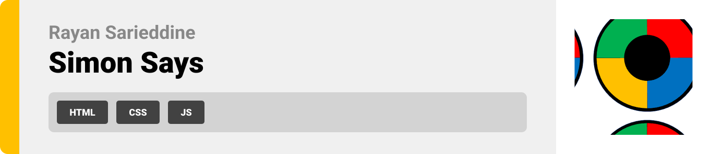
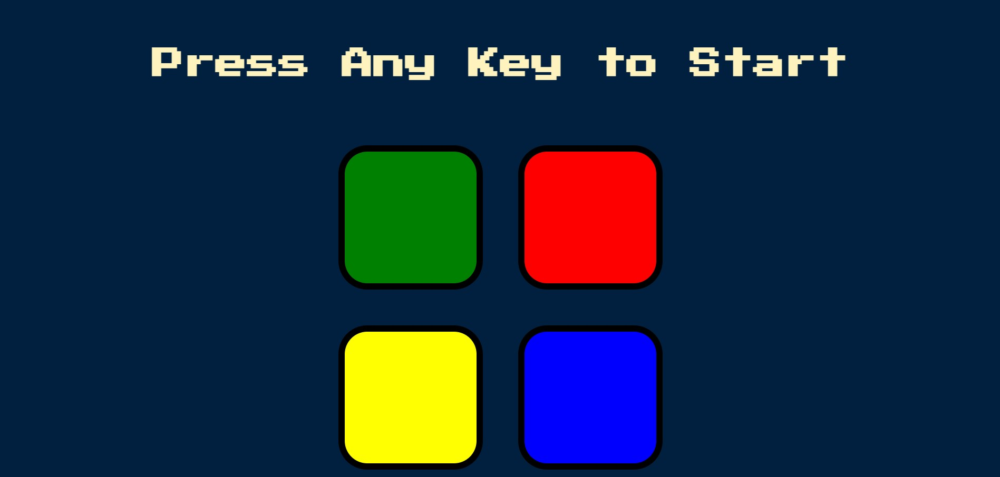

  

<!-- project philosophy -->

## This is the website version of the famous simon says color toy where you are supposed to match the colors that the computer has chosen.

  

<!-- Prototyping -->

| 
